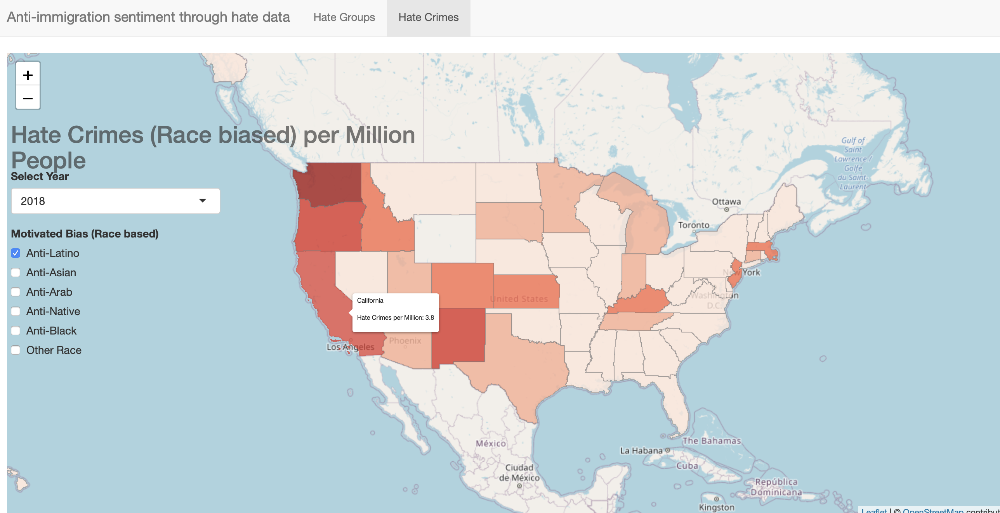

# Identifying Anti-immigration movements: Mapping Hate Crimes and Groups in the US

We use U.S. public data to identify hate groups and hate crimes towards immigrants or hispanic/Latino groups.

## 1. Data
In the folder [data](/data), we have three data sets:  
* splc-hate-groups.csv: refers to the identified hate groups since 2000 by the [Southern Poverty Law Center](https://www.splcenter.org/hate-map)
* ucr_hatecrimes.csv: refers to all the reported hate crimes in the US by [the Uniform Crime Reporting (UCR)](https://crime-data-explorer.fr.cloud.gov/downloads-and-docs) from FBI
* extremism_incidents.csv: refers to all the identified hate-related incidents since 2002 by the [ADL (Anti-Defamation League)](https://www.adl.org/adl-hate-crime-map)

Complementary Data:  
* US Census Bureau API: we used [American Community Survey (ACS)](https://www.census.gov/programs-surveys/acs/technical-documentation/summary-file-documentation.html). 
    The following demographics were downloaded:  
    * Population estimates of US States from the American Community Survey 5 Year Estimates and 1 Year Estimates. 
    * 1 Year Estimates are stored in population.csv from [US Census Bureau](https://www2.census.gov/programs-surveys/popest/tables/2010-2019/state/totals/)
    * Median Income, Foreign Born Population, Mexican Born Population, and Latin American born Population
    5 year estimates obtained from the American Community Survey.
    
    For information about US Census API using python see:
    * [Census Data python module](https://jtleider.github.io/censusdata/)
    * [Example downloading State data](https://jtleider.github.io/censusdata/example3.html)
    * [Accessing Census Data with Python](https://towardsdatascience.com/accessing-census-data-with-python-3e2f2b56e20d)

* [shapes](/data/shapes): folder with the geometries of US States and Territories.

## 2. Analysis of Data

The analysis of the data, literature review and observed facts about hate towards immigrant communities (particularly Hispanic communities) are compiled in this [report](Identifying_Anti-immigration_movements.pdf) and the code is in [analysis_hate_data.ipynb](analysis_hate_data.ipynb).

## 3. Building Dashboard Framework

### Simple Interactive Dashboard using Shiny
Shiny is an R package to build interactive web apps straight from R where one can host standalone apps on a webpage or embed them in R Markdown documents or build dashboards. 
As a simple way to build a useful dashboard, we will rely on Shiny.
There are two parts of the code: 
1. [aggregate_data.py](aggregate_data.py): A file that aggregates the data and stores it in csv files.  
Run: ```python3 aggregate_data.py``` to download the data.
2. [app.R](app.R): A file that builds the app (UI and Server) using R and Shiny.

You can check the interactive dashboard [here](https://jramtos.shinyapps.io/hate_groups/)

Example:  

